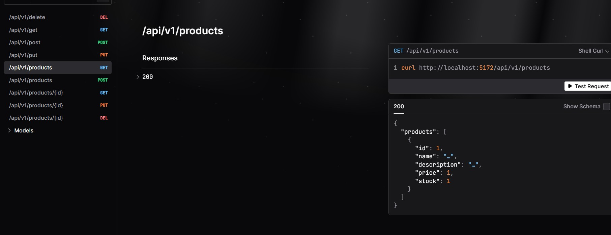

# REPR Design Pattern

 

The REPR (Request-Endpoint-Response) pattern is a design approach for organizing APIs in .NET Core applications. Unlike traditional MVC or REST-based patterns, REPR focuses on defining APIs around endpoints instead of controllers, offering improved modularity, maintainability, and scalability.

This repository demonstrates the **REPR (Request-Endpoint-Response)** pattern using **.NET 8**. It also features **OpenAPI documentation** for seamless exploration and understanding of the API. **HTTP/3/2/1** fallback code supports **Brotli** compression and falls back to **Gzip** for **response compression**.

# Project structure / technology
* .NET 8: Technology

## Hosting projects: REPRPatternApi
The executing code runs from these projects.

## Libraries:
- **OpenAPI Documentation**: Automatically generated API documentation using OpenAPI for better understanding and testing of the 
API.
- **Scalar**: Replaces Swagger for calling and testing APIs.
